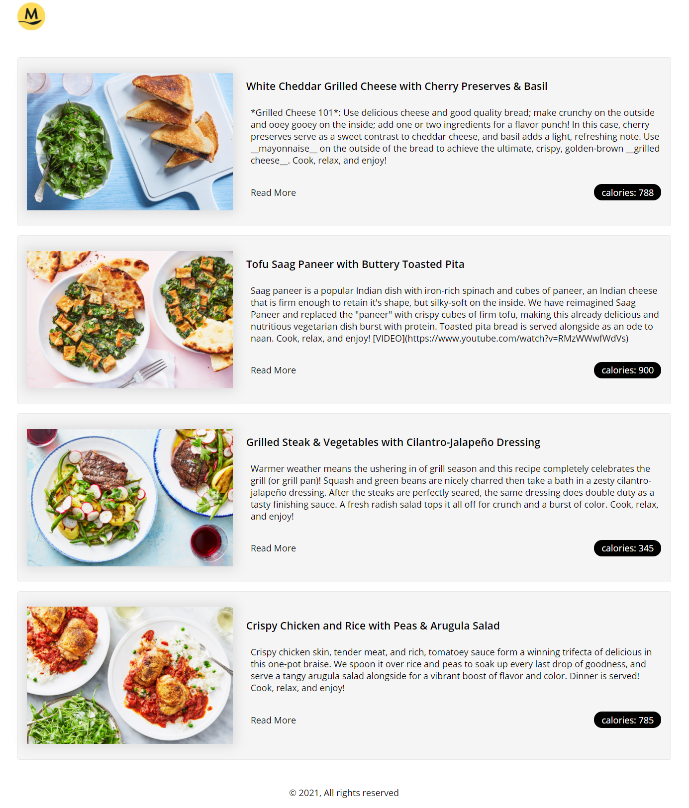

# About the Project

A Fullstack app for displaying some of the best recipes from Marley & Spoon



## Application Components

The application is made up of two components

- **ms-ui** - The Frontend is built with Next JS, React, Typescript, Styled Components & Apollo client
- **ms-server** - A Node express app for serving the data and this is exposed as a Graphql endpoint

## How to run the Projects in development mode

Please start the Express server first

```sh
  cd ./ms-server
  yarn install
  yarn dev
```

To start the UI application

```sh
  cd ./ms-ui
  yarn install
  yarn dev
```

## To build & start the Projects in production mode

Building the node app

```sh
  cd ./ms-server
  yarn build
  yarn start
```

To start the UI application

```sh
  cd ./ms-ui
  yarn install
  yarn start
```

## Build your docker Images

To build the node app as a Docker image

```sh
  cd ./ms-server
  yarn build:image
```

To build the UI app as a Docker image

```sh
  cd ./ms-server
  yarn build:image
```